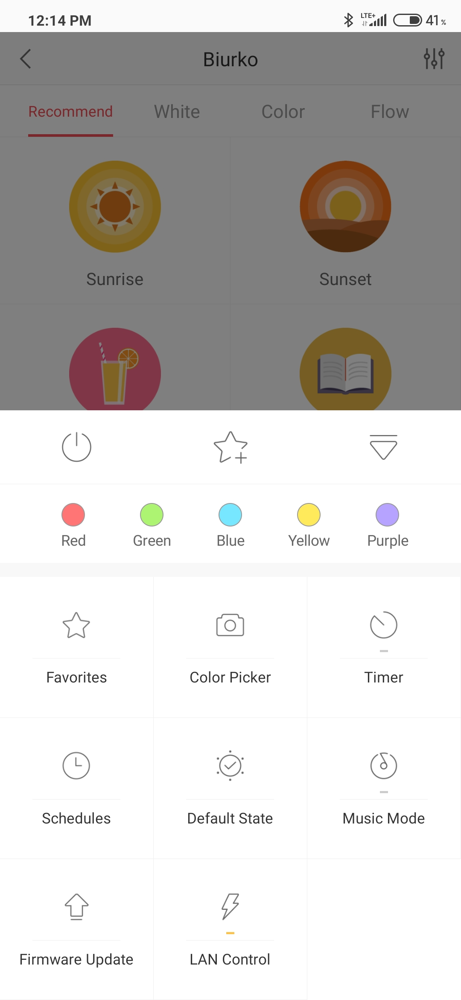
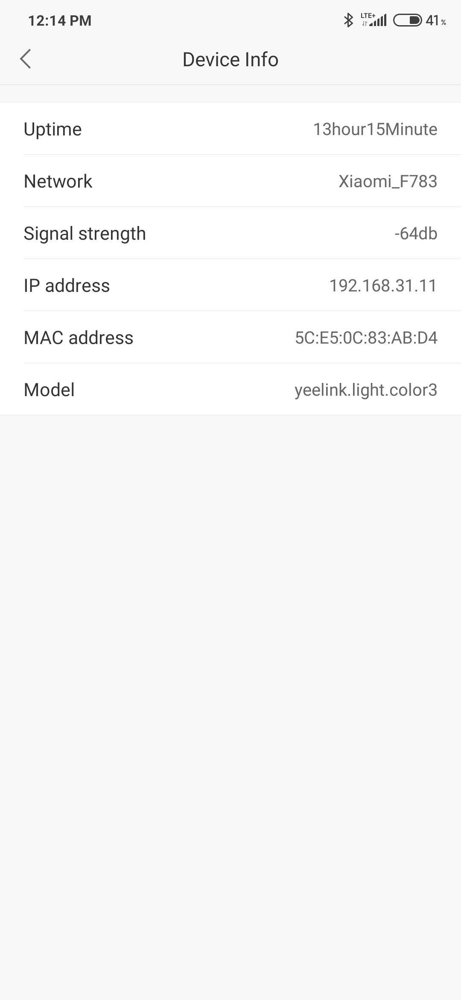

# 💡 🌈 Xiaomi Yeelight control tool written in Go

This is a simple tool which allow you to set colors on your Xiaomi Yeelight light bulbs in LAN network. **It requires you to enable LAN Control in Yeelight settings.**

To enable LAN Control and get the IP address:
---------------------------------------------

  LAN Control               |  IP address
:--------------------------:|:-------------------------:
    |  

1. Open Yeelight app.
2. Choice you light bulb.
3. Open more settings using the rightmost button on the bottom bar.
4. Click on the *LAN Control* button.
5. Open settings (rightmost button on the top bar) -> *Device Info* and read the IP address.

To run it:
----------
1. Install Golang - this depends on your operating system.
2. Execute `go build yeelight.go` to compile the source code. The result will be a binary file with the name `yeelight`.
3. Copy the executable to `/usr/local/bin` (on Unix systems) by running `sudo cp yeelight /usr/local/bin` in order to be able to execute it from any location.
4. Execute it with `yeelight <arguments here>`

Usage:
------
* `yeelight temperature <Light bulb IP address> <Light temperature in Kelvins 1700-6500> <Brightness 0-100>` - this command turns on the light bulb, switches it to white color mode and sets the desired color temperature and brightnes,
* `yeelight rgb <Light bulb IP address> <Red value 0-255> <Green value 0-255> <Blue value 0-255> <Brightness 0-100>` - this command turns on the light bulb, switches it to RGB/HSV color mode and sets the desired color and brightnes,
* `yeelight hsv <Light bulb IP address> <Hue 0-359> <Saturation 0-100> <Brightness/Value 0-100>` - this command turns on the light bulb, switches it to RGB/HSV color mode and sets the desired color and brightnes,
* `yeelight off <Light bulb IP address>` - this command turns off the light bulb,
* `yeelight active_discovery` - this command sends multicast UDP/SSDP discovery message and collect responses displaying light bulbs IP addresses,
* `yeelight passive_discovery` - similar to previous command, this command binds to SSDP multicast group, and without sending discovery packet, collects the periodic advertisements, displaying light bulbs IP addresses,
* `yeelight help` - this command just displays help and exits.

Protocol details can be found here: https://www.yeelight.com/download/Yeelight_Inter-Operation_Spec.pdf
